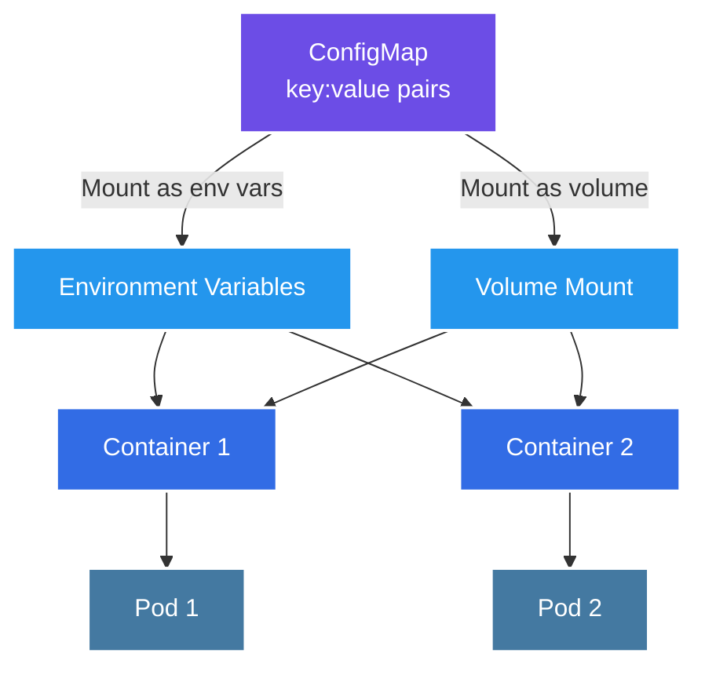

# 🔧 Kubernetes ConfigMap Management System

[](https://github.com/TheToriqul/k8s-configmap-volume)


## 📋 Project Overview

This project demonstrates my implementation of Kubernetes ConfigMaps for managing application configurations, specifically focusing on MySQL database configuration management. Through this project, I've developed a robust system that separates configuration data from application code, enabling better maintainability and security in Kubernetes environments.

## 🎯 Key Objectives

- Implement ConfigMaps using both imperative and declarative approaches
- Demonstrate secure management of sensitive database configurations
- Showcase best practices for configuration management in Kubernetes
- Create a scalable and maintainable configuration system
- Provide comprehensive documentation for future reference

## 🏗️ Project Architecture

The project implements Kubernetes ConfigMaps with two primary mounting strategies:



This architecture enables:
- Separation of configuration from application code
- Configuration sharing across multiple pods
- Two flexible mounting options:
  1. Environment variables for simple key-value configurations
  2. Volume mounts for file-based configurations
- Dynamic updates through volume mounts
- Centralized configuration management

## 💻 Technical Stack

- **Container Orchestration**: Kubernetes
- **Database**: MySQL
- **Configuration Management**: Kubernetes ConfigMaps
- **Infrastructure**: Docker containers

## 🚀 Getting Started

<details>
<summary>🐳 Prerequisites</summary>

- Kubernetes cluster (local or cloud-based)
- kubectl CLI tool installed
- Basic understanding of Kubernetes concepts
- Docker installed (for local development)

</details>

<details>
<summary>⚙️ Installation</summary>

1. Clone the repository:
   ```bash
   git clone https://github.com/TheToriqul/k8s-configmap-volume.git
   ```
2. Navigate to the project directory:
   ```bash
   cd k8s-configmap-volume
   ```
3. Apply the ConfigMap configuration:
   ```bash
   kubectl apply -f config-map.yaml
   ```

</details>

## 💡 Key Learnings

### Technical Mastery:

1. Advanced Kubernetes ConfigMap implementation strategies
2. Secure configuration management in containerized environments
3. MySQL database configuration in Kubernetes
4. Infrastructure as Code (IaC) principles
5. Kubernetes resource management and optimization

### Professional Development:

1. Best practices for configuration management in enterprise environments
2. Documentation and technical writing skills
3. System architecture design principles
4. DevOps workflow optimization
5. Security-first approach to configuration management

### 🔄 Future Enhancements

<details>
<summary>View Planned Improvements</summary>

1. Implementation of SecretProviderClass for enhanced security
2. Dynamic configuration updates without pod restarts
3. Integration with external configuration management tools
4. Automated validation and testing pipeline
5. Multi-environment configuration management
6. Configuration versioning and rollback capabilities

</details>

## 🙌 Contribution

Contributions are welcome! Feel free to [open an issue](https://github.com/TheToriqul/k8s-configmap-volume/issues) or submit a [pull request](https://github.com/TheToriqul/k8s-configmap-volume/pulls) to suggest improvements or add features.

## 📧 Connect with Me

- 📧 Email: toriqul.int@gmail.com
- 📱 Phone: +65 8936 7705, +8801765 939006
- 🌐 LinkedIn: [@TheToriqul](https://www.linkedin.com/in/thetoriqul/)
- 🐙 GitHub: [@TheToriqul](https://github.com/TheToriqul)
- 🌍 Portfolio: [TheToriqul.com](https://thetoriqul.com)

## 👏 Acknowledgments

- [Poridhi](https://devops.poridhi.io/) for providing comprehensive learning resources
- The Kubernetes community for excellent documentation and support
- Fellow developers who provided valuable feedback and suggestions

---

Thank you for exploring my Kubernetes ConfigMap Management System project. I hope you find it helpful in understanding how to effectively manage configurations in Kubernetes environments! 🚀